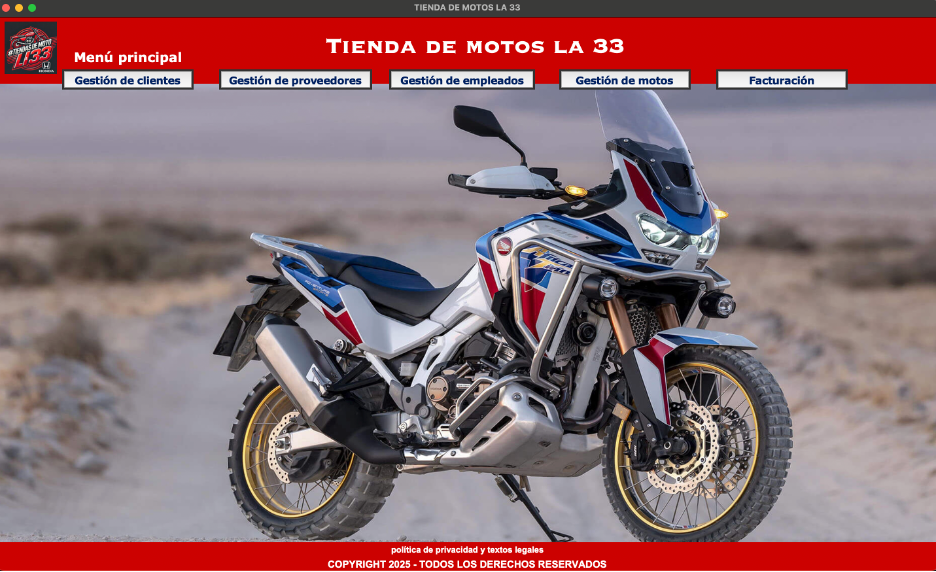

# App Tienda de Motos la 33
Este es un proyecto de interfaz gráfica desarrollado en Python utilizando Tkinter. La aplicación gestiona la visualización de información sobre una tienda de motos.

## Características
- **Interfaz gráfica con Tkinter**
- **Ventana principal con menú**
- **Manejo de ventanas secundarias**
- **Logo y pie de página en todas las ventanas**
- **Imágenes y diseño responsivo**

## Requisitos
Asegúrate de tener instaladas las siguientes dependencias antes de ejecutar el proyecto:

```sh
pip install pillow
```

## Estructura del Proyecto
```
📂 tienda_motos
 ├── gui/
 │   ├── iconos/
 │   │   ├── logo.png
 │   │   ├── main.jpg
 │   ├── estilos.py
 │   ├── ventanas.py
 ├── main.py
 ├── README.md
 
```

```
APP_TIENDA_MOTOS/
│── gui/
│   ├── main_window.py    # Interfaz principal con Tkinter
│   ├── componentes.py    # Widgets reutilizables
│── src/
│   ├── conexion.py       # Módulo de conexión a la BD
│   ├── consultas.py      # Funciones de consulta SQL
│   ├── creacion_tablas.py # Creación de la BD
│── db_tienda_motos_la33.db # Base de datos SQLite
│── main.py               # Archivo principal
│── README.md
│── LICENSE
```

## Instalación y Ejecución
1. Clona el repositorio:

```sh
git clone https://github.com/dcanosu/App-tienda-motos-la-33.git
```

2. Accede al directorio del proyecto:
```sh
cd tienda-motos
```

3. Ejecuta la aplicación:
```sh
python main.py
```

## Uso
- Al ejecutar la aplicación, se abrirá la ventana principal con el logo y el menú.
- Puedes navegar entre las diferentes secciones de la aplicación.
- En todas las ventanas, se mostrará el logo y el pie de página con la información de derechos reservados.

## Capturas de Pantalla
- **Menú principal**


## Autor
Desarrollado por Daniel Cano Suarez y Mateo Agudelo Restrepo.

## Licencia
Este proyecto está bajo la licencia Apache-2.0 license.
"""
1️⃣ fetchall() → Obtener todos los resultados
📌 Este método devuelve todas las filas de la consulta en una lista de tuplas.
Cuándo usarlo: Cuando necesitas recuperar todos los registros de una tabla.

cursor.execute("SELECT * FROM ventas")
ventas = cursor.fetchall()  # Obtiene TODAS las filas

for venta in ventas:
    print(venta)


2️⃣ fetchone() → Obtener una sola fila
📌 Devuelve solo la primera fila de la consulta como una tupla.
Cuándo usarlo: Cuando solo esperas un resultado o solo necesitas uno.

cursor.execute("SELECT * FROM ventas")
venta = cursor.fetchone()  # Obtiene SOLO la primera fila
print(venta)


3️⃣ fetchmany(n) → Obtener n filas
📌 Devuelve una lista con hasta n filas de la consulta.
Cuándo usarlo: Cuando quieres limitar la cantidad de resultados.

cursor.execute("SELECT * FROM ventas")
ventas = cursor.fetchmany(2)  # Obtiene máximo 2 filas

for venta in ventas:
    print(venta)

"""
